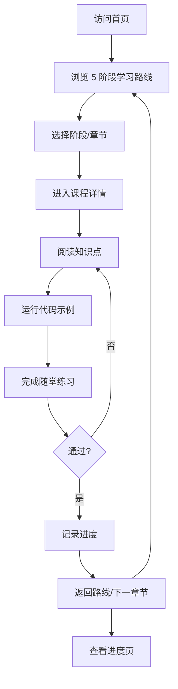

# Python 学习平台 - 产品需求文档 (PRD)

## 1. 产品概述

PyPath 是一款面向零基础到进阶学习者的 Python 互动学习平台，通过结构化学习路线、可运行代码示例、随堂练习和进度跟踪，帮助用户系统掌握 Python 编程。

- 核心目标：解决"Python 学习资料零散、缺乏系统路径"的问题，提供一站式的可视化学习体验。
- 目标用户：编程初学者、转行者、Python 自学者。
- 产品价值：通过模块化课程、可交互代码运行环境、进度可视化，让 Python 学习更高效、更有成就感。

## 2. 核心功能

### 2.1 用户角色
本产品为单用户学习应用，无需登录/注册系统。

| 角色 | 身份 | 核心权限 |
|------|------|----------|
| 学习者 | 默认 | 浏览所有课程、运行代码示例、提交练习、查看进度 |

### 2.2 功能模块

1. **首页（学习路线总览）**：Hero 区、学习阶段卡片（5 大阶段）、推荐入口、统计概览
2. **课程详情页**：知识点讲解、可运行代码示例、随堂练习、章节导航
3. **交互式代码运行器**：内置代码编辑、Python 语法高亮、输出结果展示（使用浏览器内 Python 解释器 Pyodide）
4. **练习中心**：选择题 + 编程题、答案校验、提示系统
5. **进度跟踪页**：已完成章节、学习时长、成就徽章、可视化进度条

### 2.3 页面详情

| 页面名称 | 模块名称 | 功能描述 |
|---------|---------|---------|
| 首页 | Hero 区 | 展示学习平台标语、Python 版本徽章、CTA 按钮 |
| 首页 | 学习路线 | 5 阶段卡片：入门语法 → 数据结构 → 面向对象 → 标准库 → 实战项目 |
| 首页 | 数据统计 | 已学课程数、代码运行数、连续学习天数 |
| 课程详情 | 章节导航 | 左侧显示当前阶段所有章节，可跳转 |
| 课程详情 | 内容区 | Markdown 渲染的知识点、代码块、说明文字 |
| 课程详情 | 代码运行器 | 可编辑的代码区 + 运行按钮 + 输出面板 |
| 课程详情 | 随堂练习 | 选择题或填空题，提交后即时反馈 |
| 进度页 | 进度概览 | 五大阶段的进度条、已掌握知识点数量 |
| 进度页 | 成就徽章 | 解锁式徽章展示（首次运行代码、完成 10 题等） |
| 进度页 | 学习日历 | 简易热力图，记录每日学习情况 |

## 3. 核心流程

用户进入首页 → 浏览学习路线并选择阶段 → 进入课程详情 → 阅读知识点并运行代码 → 完成随堂练习 → 系统记录进度 → 进度页查看学习成果

## 4. 用户界面设计

### 4.1 设计风格

- **主色调**：深空黑 `#0B0D12` + 翠绿/藤蔓绿 `#7EE787`（Python 经典色）+ 暖橙 `#FFB454`（强调）
- **次要色**：石墨灰 `#1B1F27`、浅灰文本 `#9CA3AF`、纯白 `#FFFFFF`
- **按钮风格**：圆角 12px，主按钮带绿色辉光阴影，悬停时微微抬升
- **字体**：标题使用 `JetBrains Mono` 或 `Space Grotesk`（突出技术感），正文使用 `Inter`，代码使用 `JetBrains Mono`
- **布局风格**：左侧固定导航 + 右侧内容流，卡片化模块，圆角 16px
- **图标风格**：lucide-react 线性图标，1.5px 描边

### 4.2 页面设计概述

| 页面名称 | 模块名称 | UI 元素 |
|---------|---------|---------|
| 首页 | Hero 区 | 全屏暗色背景 + Python logo 动画 + 巨幅标题 "Master Python, One Line at a Time" + 副标题 + 双 CTA |
| 首页 | 学习路线 | 5 张阶段卡片，水平排布，每张含图标、阶段名、章节数、进度环 |
| 首页 | 数据统计 | 3 列数字 + 标签，下划线分隔 |
| 课程详情 | 章节导航 | 左侧 240px 固定侧栏，列表项带状态点（已完成✓/进行中●/未开始○）|
| 课程详情 | 内容区 | 最大宽度 880px，阅读体验舒适，代码块带"复制"和"运行"按钮 |
| 课程详情 | 代码运行器 | Monaco-like 编辑器，主题暗色，底部输出面板可折叠 |
| 进度页 | 进度概览 | 5 个进度环横向排列，下方为详细数字 |
| 进度页 | 成就徽章 | 网格化卡片，锁定态灰度显示 |

### 4.3 响应式

桌面优先（1280px+），向下兼容平板（768px）和手机（375px）。手机端左侧导航转为抽屉式，代码区横向滚动。

### 4.4 视觉细节

- 全站使用细噪点纹理叠加，营造高级感
- 鼠标悬停卡片时有 1px 绿色边框微光
- 代码区使用类 IDE 的语法高亮配色
- 滚动时 Hero 区视差渐变
- 数字使用等宽字体 + 渐变色填充
