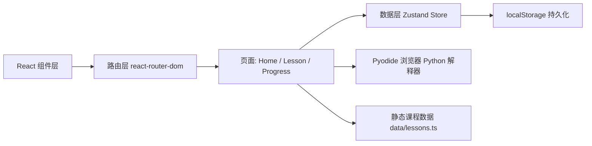

# Python 学习平台 - 技术架构文档

## 1. 架构设计

本项目为纯前端单页应用，所有课程数据、用户进度均在前端存储（localStorage），无需后端服务。



## 2. 技术描述

- 前端框架：React@18 + TypeScript
- 构建工具：Vite@5
- 样式方案：TailwindCSS@3 + 自定义 CSS 变量
- 路由：react-router-dom@6
- 状态管理：Zustand
- 图标：lucide-react
- Python 解释器：Pyodide（CDN 加载，WebAssembly 形式在浏览器运行 Python）
- 持久化：localStorage（用户进度、解锁状态）
- 字体：Google Fonts - JetBrains Mono + Space Grotesk + Inter

无后端、无数据库。所有内容为静态课程数据，存放在 `src/data/lessons.ts`。

## 3. 路由定义

| 路由 | 用途 |
|------|------|
| `/` | 首页：学习路线总览、统计、Hero |
| `/learn/:stageId` | 阶段详情：列出该阶段所有章节 |
| `/lesson/:lessonId` | 课程详情：知识点 + 代码运行器 + 练习 |
| `/progress` | 进度页：进度环、徽章、学习日历 |
| `/practice` | 练习中心：综合练习题库 |

## 4. 数据模型

### 4.1 课程数据结构

```typescript
interface Lesson {
  id: string;
  stage: 'basics' | 'data-structures' | 'oop' | 'stdlib' | 'projects';
  title: string;
  description: string;
  estimatedMinutes: number;
  content: LessonSection[];
  exercises: Exercise[];
}

interface LessonSection {
  type: 'text' | 'code' | 'note';
  body: string;
  language?: 'python';
}

interface Exercise {
  id: string;
  type: 'multiple-choice' | 'fill-blank' | 'predict-output';
  question: string;
  options?: string[];
  answer: string | number;
  hint: string;
  explanation: string;
}
```

### 4.2 用户进度数据结构

```typescript
interface UserProgress {
  completedLessons: string[];
  completedExercises: string[];
  totalCodeRuns: number;
  streakDays: number;
  lastStudyDate: string;
  unlockedBadges: string[];
}
```

## 5. 学习路线内容规划

### 阶段 1：Python 入门基础
- 变量与数据类型
- 运算符与表达式
- 条件语句
- 循环结构
- 函数基础

### 阶段 2：数据结构
- 列表 List
- 元组 Tuple
- 字典 Dict
- 集合 Set
- 字符串深入

### 阶段 3：面向对象
- 类与对象
- 继承
- 封装与多态
- 魔术方法
- 模块与包

### 阶段 4：标准库
- 文件 I/O
- 异常处理
- datetime 与 time
- JSON 处理
- 正则表达式

### 阶段 5：实战项目
- 猜数字游戏
- 简易计算器
- Todo List CLI
- 数据分析入门
- Web 爬虫基础

## 6. 性能与可用性

- 课程数据按阶段懒加载
- Pyodide 在首次使用时加载并缓存
- 代码编辑器使用 textarea + 语法高亮层（避免引入过重的 Monaco）
- 移动端代码区横向滚动，避免压缩
- 进度数据 localStorage 持久化，刷新不丢失

## 7. 项目结构

```
src/
├── components/         # 通用组件
│   ├── Layout.tsx
│   ├── CodeRunner.tsx
│   ├── Sidebar.tsx
│   ├── Hero.tsx
│   ├── StageCard.tsx
│   └── ProgressRing.tsx
├── pages/              # 页面
│   ├── Home.tsx
│   ├── Learn.tsx
│   ├── Lesson.tsx
│   ├── Progress.tsx
│   └── Practice.tsx
├── data/               # 静态课程数据
│   └── lessons.ts
├── store/              # Zustand
│   └── useProgressStore.ts
├── lib/                # 工具
│   └── pyodide.ts
├── App.tsx
└── main.tsx
```
