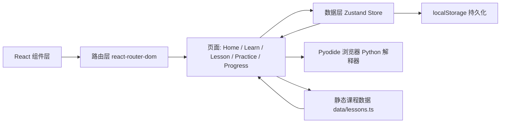

# PyPath · Python 互动学习平台 — 技术架构文档

## 1. 架构设计

本项目为**纯前端单页应用（SPA）**，所有课程数据、用户进度均在前端存储（`localStorage`），**无后端、无数据库**。



分层职责：

- **组件层**：负责 UI 渲染，零业务逻辑
- **页面层**：组合组件、读取 store、调度数据
- **数据层**：Zustand 提供全局状态，自动持久化到 `localStorage`
- **静态数据层**：所有课程内容硬编码在 `src/data/lessons.ts`，无后端拉取

## 2. 技术栈

| 类别 | 选型 | 版本 |
|------|------|------|
| 前端框架 | React | 18 |
| 类型系统 | TypeScript | ~5.8 |
| 构建工具 | Vite | 6 |
| 样式方案 | TailwindCSS | 3 |
| 路由 | react-router-dom | 7 |
| 状态管理 | Zustand（含 `persist` 中间件） | 5 |
| 图标 | lucide-react | 0.511 |
| 工具 | clsx、tailwind-merge | 2 / 3 |
| Python 解释器 | Pyodide（CDN 加载，WebAssembly 形式在浏览器运行 Python） | latest |
| 持久化 | `localStorage`（key: `pypath-progress`） | — |
| 字体 | Google Fonts — JetBrains Mono + Space Grotesk + Inter | — |
| 部署 | Vercel（`vercel.json`） | — |

> 所有依赖通过 npm 管理，开发/构建/类型检查/代码风格检查脚本见 `package.json`。

## 3. 路由定义

定义在 `src/App.tsx`，使用 `react-router-dom@7` 的 `BrowserRouter` + 嵌套 `Route`：

| 路由 | 用途 | 对应页面 |
|------|------|----------|
| `/` | 首页：Hero、学习路线、实时统计 | `pages/Home.tsx` |
| `/learn` | 全部阶段总览 | `pages/Learn.tsx` |
| `/learn/:stageId` | 单个阶段下的章节列表 | `pages/Learn.tsx` |
| `/lesson/:lessonId` | 课程详情：知识点 + 代码运行器 + 随堂练习 | `pages/Lesson.tsx` |
| `/practice` | 练习中心 | `pages/Practice.tsx` |
| `/progress` | 进度页：统计、徽章、学习日历热力图 | `pages/Progress.tsx` |
| `*` | 兜底：跳回首页 | `pages/Home.tsx` |

所有页面都被 `components/Layout.tsx` 包裹，提供统一的左侧导航与移动端抽屉。

## 4. 数据模型

类型定义集中在 [`src/types.ts`](../../src/types.ts)。

### 4.1 阶段（Stage）

```typescript
type StageId = "basics" | "data-structures" | "oop" | "stdlib" | "projects";

interface Stage {
  id: StageId;
  index: number;                              // 1-5，用于 STAGE 0X 角标
  title: string;                              // 阶段中文名
  tagline: string;                            // 一句话副标题
  description: string;                        // 阶段详细介绍
  accent: "vine" | "ember" | "sky" | "rose" | "violet"; // 进度环主题色
  icon: "spark" | "stack" | "cube" | "library" | "rocket"; // 映射 lucide-react
  lessonIds: string[];                        // 包含的章节 id
}
```

### 4.2 章节（Lesson）

```typescript
interface Lesson {
  id: string;                                 // 唯一 id，如 "basics-01-variables"
  stage: StageId;                             // 所属阶段
  order: number;                              // 阶段内排序（1-5）
  title: string;                              // 章节主标题
  subtitle: string;                           // 章节副标题（如 "Python 的记忆细胞"）
  description: string;                        // 章节简介
  estimatedMinutes: number;                   // 预计学习时长
  content: LessonSection[];                   // 正文内容
  exercises: Exercise[];                      // 随堂练习
}
```

### 4.3 章节内容（LessonSection）

```typescript
type LessonSectionType = "text" | "code" | "note";

interface LessonSection {
  type: LessonSectionType;
  body: string;                              // text/note: Markdown；code: 原始 Python 源码
  caption?: string;                          // 仅 code 类型，展示在代码块上方
}
```

### 4.4 练习（Exercise）

```typescript
type ExerciseType = "multiple-choice" | "fill-blank" | "predict-output";

interface Exercise {
  id: string;
  type: ExerciseType;
  question: string;                           // 题干
  options?: string[];                         // multiple-choice 时使用
  answer: string;                             // 正确答案
  hint: string;                               // 提示
  explanation: string;                        // 详细解析
}
```

### 4.5 用户进度（ProgressState）

定义在 `src/store/useProgressStore.ts`，通过 Zustand `persist` 中间件自动同步到 `localStorage` 的 `pypath-progress` key：

```typescript
interface ProgressState {
  completedLessons: string[];                 // 已完成章节 id
  completedExercises: string[];               // 已答对练习 id
  totalCodeRuns: number;                      // 代码累计运行次数
  streakDays: number;                         // 连续学习天数
  lastStudyDate: string;                      // 最近学习日期 yyyy-mm-dd
  unlockedBadges: string[];                   // 已解锁徽章 id
  studyLog: Record<string, number>;           // yyyy-mm-dd -> 当日学习分钟数

  markLessonComplete: (lessonId: string) => void;
  markExerciseComplete: (exerciseId: string) => void;
  registerCodeRun: () => void;
  addStudyMinutes: (minutes: number) => void;
  unlockBadge: (badge: string) => void;
  reset: () => void;                          // 一键重置
}
```

#### 状态变更副作用

| Action | 副作用 |
|--------|--------|
| `markLessonComplete` | 检查并解锁 `first-lesson` / `five-lessons` / `all-rounder` 徽章；触发 `addStudyMinutes(2)` |
| `markExerciseComplete` | 检查并解锁 `quiz-novice` / `quiz-master` 徽章 |
| `registerCodeRun` | 检查并解锁 `first-run` / `runner` 徽章 |
| `addStudyMinutes` | 更新 `studyLog`、刷新 `lastStudyDate`、重算 `streakDays`（与昨日比较） |

## 5. 成就徽章

徽章定义在 `src/pages/Progress.tsx` 的 `BADGES` 数组，**共 7 个**，分为三类：

| ID | 名称 | 解锁条件 | 触发点 |
|----|------|----------|--------|
| `first-lesson` | 初出茅庐 | 完成第 1 个章节 | `markLessonComplete` |
| `five-lessons` | 小有所成 | 完成 5 个章节 | `markLessonComplete` |
| `all-rounder` | 通关玩家 | 完成 15 个章节 | `markLessonComplete` |
| `first-run` | Hello World | 首次运行代码 | `registerCodeRun` |
| `runner` | 代码狂人 | 累计运行代码 10 次 | `registerCodeRun` |
| `quiz-novice` | 答题新手 | 答对 5 道练习 | `markExerciseComplete` |
| `quiz-master` | 答题达人 | 答对 15 道练习 | `markExerciseComplete` |

## 6. Pyodide 集成

封装在 `src/lib/pyodide.ts`，关键设计：

- **懒加载**：首次调用 `runPython` 时才从 CDN 加载 Pyodide runtime
- **单例缓存**：加载完成后缓存实例，避免重复加载
- **超时控制**：执行超过阈值主动中断，防止死循环
- **stdout/stderr 捕获**：拦截 `print` 与异常，写入输出面板

```ts
// 伪代码
let pyodide: Pyodide | null = null;
export async function runPython(code: string): Promise<{ stdout: string; stderr: string }> {
  if (!pyodide) pyodide = await loadPyodide({ indexURL: "https://cdn.jsdelivr.net/pyodide/..." });
  // 重定向 stdout / stderr，重置后执行
  return { stdout, stderr };
}
```

## 7. 学习日历热力图

`src/pages/Progress.tsx` 中的 `HeatMap` 组件基于 `studyLog` 渲染最近 **12 周**（84 天）的热力图：

- 按周分列（7 天 × 12 周）
- 颜色分 4 档：`bg-vine-300/20` / `40` / `65` / `100`，按当日学习分钟数与最大值之比分配
- 鼠标悬停显示具体日期与分钟数

## 8. 学习路线内容规划

### 阶段 1：Python 入门基础
- 变量与数据类型
- 运算符与表达式
- 条件语句
- 循环结构
- 函数基础

### 阶段 2：数据结构
- 列表 List
- 元组 Tuple
- 字典 Dict
- 集合 Set
- 字符串深入

### 阶段 3：面向对象
- 类与对象
- 继承
- 封装与多态
- 魔术方法
- 模块与包

### 阶段 4：标准库
- 文件 I/O
- 异常处理
- datetime 与 time
- JSON 处理
- 正则表达式

### 阶段 5：实战项目
- 猜数字游戏
- 简易计算器
- Todo List CLI
- 数据分析入门
- Web 爬虫基础

## 9. 性能与可用性

- **首屏体积**：课程数据全部内联进 JS bundle，**首次仅在用户点击「运行代码」时才加载 Pyodide**（按需）
- **Pyodide 缓存**：加载完成后缓存到内存单例，刷新页面从浏览器缓存读取
- **代码编辑器**：使用 `<textarea>` + 语法高亮层（`src/lib/highlight.ts`），避免引入过重的 Monaco Editor
- **移动端**：布局自适应至 375px，代码区横向滚动，导航转为抽屉
- **进度持久化**：所有用户数据写入 `localStorage`（key=`pypath-progress`），刷新不丢失
- **重置入口**：`/progress` 页右上角「重置进度」按钮

## 10. 项目结构

```
src/
├── components/              # 通用组件
│   ├── Layout.tsx           # 全局布局（侧边栏 + 主区 + 移动端抽屉）
│   ├── Sidebar.tsx          # 左侧导航
│   ├── CodeRunner.tsx       # 代码编辑器 + 运行按钮 + 输出面板
│   ├── ExerciseCard.tsx     # 练习题卡片
│   ├── StageCard.tsx        # 阶段卡片
│   └── ProgressRing.tsx     # 进度环（SVG）
├── pages/                   # 页面
│   ├── Home.tsx             # 首页（Hero + 学习路线 + 实时统计）
│   ├── Learn.tsx            # 阶段详情 / 章节列表
│   ├── Lesson.tsx           # 课程详情（知识点 + 代码 + 练习）
│   ├── Practice.tsx         # 练习中心
│   └── Progress.tsx         # 进度页（统计、徽章、热力图）
├── data/
│   └── lessons.ts           # 静态课程数据（25 章节 + 5 阶段定义）
├── store/
│   └── useProgressStore.ts  # Zustand 状态（含徽章解锁、连续打卡、studyLog）
├── lib/
│   ├── pyodide.ts           # Pyodide 加载与执行封装
│   ├── highlight.ts         # Python 语法高亮
│   └── utils.ts             # cn 工具函数
├── types.ts                 # 全局类型定义
├── App.tsx                  # 路由配置
├── main.tsx                 # 入口
└── index.css                # 全局样式 + Tailwind 入口
```

## 11. 部署

- 部署平台：**Vercel**（`vercel.json`）
- 构建命令：`npm run build`（`tsc -b && vite build`）
- 产物目录：`dist/`
- 静态站点模式：所有路由由 `index.html` 兜底（SPA fallback）

## 12. 后续演进方向

- 接入后端 API，实现跨设备同步进度
- 引入 Monaco Editor + LSP 提供更专业的代码编辑体验
- 增加「AI 助教」：基于大模型对错误代码给出建议
- 支持用户上传/导入自定义课程（CMS）
- PWA 化，支持离线学习
